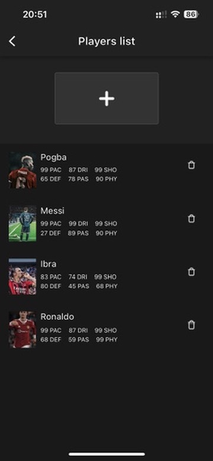
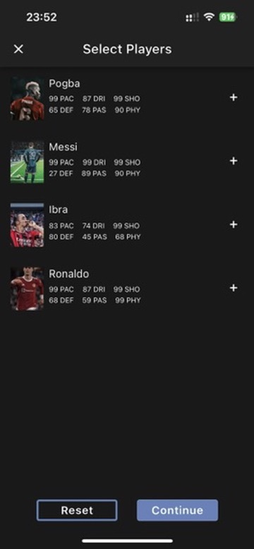
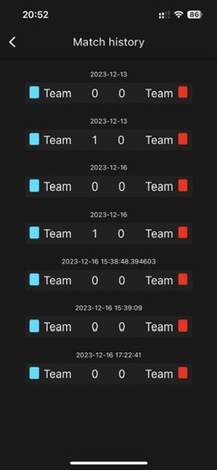
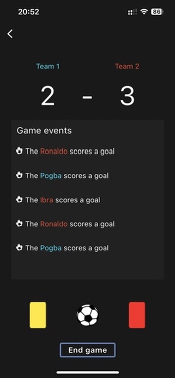
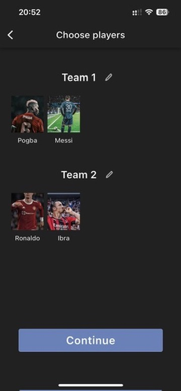
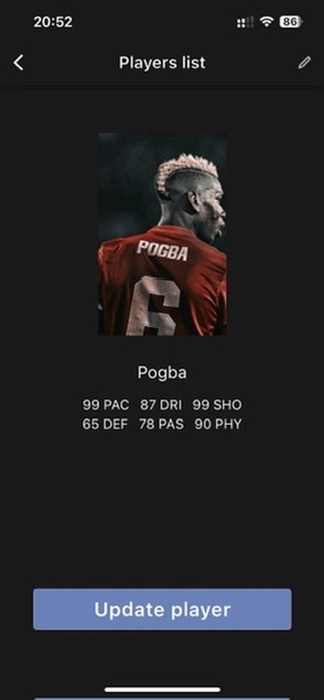

# ⚽️ Matchify

### ✨ Main idea
Sometimes we need to have a rest and try some another activity)
This application was written for keeping records of the games in a convenient way. And I hope, that it can be useful for the others. For understanding what does this application do just look at these features that we provided in the app: 
- ⚽️ Start a new match.

- 🧩 Create and update players with a specific statistic like in FIFA games.

- 💿 Store your games history with the date and match results.

- 🙂 Funny banners for uplifting the mood

- ⚜️ An Interesting design with enough good UI / UX


### 🔭 Clarifications
The application has a pretty simple version, all the data stores in a mobile device, so if you delete it, the story will be lost. In our opinion, we don't need backend server for storing it, but it can be added in future. 

## 🚀 How to run it ? 
###  VS Code
Clone the repo, open it it Visual Studio Code and go to the directory matchify:

``` 
git clone https://github.com/Jonikorjk/matchify.git
cd matchify
```

Download the dependencies, select your running device and launch it: 
```
flutter pub get 
flutter run
```

## 💫 Possible improvements 
1. Add backend to store games data on server
1. Add Telegram bot that can be useful for filling in players 
 
## 🌁 Preview 
 
 





# ✍️ Authors 
🛠️ Yevhenii Serdiukov - Development part

🍥 Marina Yaroshenko - Design part


